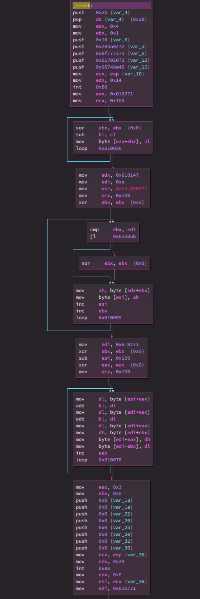

We start with a binary called `mixer`:
```
$ file mixer
mixer: ELF 64-bit LSB executable, x86-64, version 1 (SYSV), statically linked, stripped
```

Let's open it in Binary Ninja. The `_start` function is really short:

`mprotect` modifies protection for particular places in memory (depending on compilation parameters, you can't always execute and read from every place).
Let's see what the `prot` argument for `sys_mprotect` is, for this consult `man mprotect`:
```
       prot is a combination of the following access flags: PROT_NONE or a bitwise-or of the other values in the following list:
       PROT_NONE  The memory cannot be accessed at all.
       PROT_READ  The memory can be read.
       PROT_WRITE The memory can be modified.
       PROT_EXEC  The memory can be executed.
```
Number `7` is `111` in binary, so it means that we ask for the ability to read, write and execute, from address `0x600000` up till `0x700000`.

Next, there's some xoring with one byte hardcoded key, in pseudo-C it's
```c
char *tab = 0x610000;
for (size_t i = 0; i < 0x791; ++i) {
    tab[i] ^= 0x2a;
}
```

What happens next, is we see a [`ret far`](https://www.felixcloutier.com/x86/ret). We see that far return is a so-called intersegment return, which means setting `cs` to something different than default. The `0x23` is the code segment and `0x610000` (the array we just modified) is the return address. It turns out that `cs==0x23` on 64 bit Linux means a switch to 32-bit mode. Let's decrypt that chunk from memory and see what does it mean as a 32 bit code. This can be done in Binary Ninja by dumping that part of the file, and loading it as a raw 32-bit file, with entry point at `0x610000`:
```python
with open('file.bin', 'wb') as f:
    data = bv.read(0x610000, 0x791)
    xored = bytes([x^0x2a for x in data])
    f.write(data)
```


(last block from previous screenshot overlaps)


We quickly notice that there's just one point of return, and it's again a `ret far`, this time with `cs=0x33`, which is a return to 64 bit mode. The address there points just at the `cmp eax, 0x0`:

Examining strings (moved to `rsi`), we know that `eax` needs to equal 0 at the end of our 32 bit code.

Back to the x86 bit code: after a while of careful reversing, we notice this is a stream cipher (RC4 specifically, but it's not important): which takes 32 bytes from the `stdin`, takes a hardcoded key from memory, generates keystream and xors the input (which is at `0x610771`) and the output (which is at `0x610371`). The expected encrypted flag is also in the memory - at `0x610151`. We know it, because there's a checksum, which verifies that the `xor(computed_encrypted_flag) ^ xor(expected_encrypted_flag)` is zero (this is the `eax` at the end). This is obviously too few information, so we take an obvious guess, that the memory content there is actually the encrypted flag. To extract the flag, we use the property of xor, which tells that if `flag xor keystream == known_data`, then `flag == keystream xor known_data`. To get the `keystream` and `known_data`, we simply use `gdb` and supply input consisting of all zeros (which we store in file `input`, for convenience):
```
$ gdb ./mixer
set architecture i386:x64-32 # necessary to see correct instructions
# first let's break before the ret far, idk why but otherwise the binary segfaults
b *0x401053
# now let's break before checksum verification
# also, because I didn't decrypt the memory directly in Binary Ninja (which I could have), and didn't patch-out the decryption process, gdb shows me wrong instructions, but that doesn't matter
b *0x61011f
r < input
c 2 # skip to after second breakpoint
# now that we are here, let's read the memory
pwndbg> x/32xb 0x610371
0x610371:	0xf4	0xbc	0xcb	0xaf	0x8b	0x52	0x0c	0x79
0x610379:	0xbe	0xcd	0x00	0x1b	0xb0	0x86	0x7d	0xa6
0x610381:	0x82	0x72	0xf8	0xda	0xc1	0x42	0xba	0xf6
0x610389:	0x07	0xbd	0xd1	0x05	0x74	0xcb	0x78	0xf6
pwndbg> x/32xb 0x610151
0x610151:	0x84	0xd3	0xb8	0xca	0xe2	0x36	0x63	0x17
0x610159:	0xc5	0xae	0x30	0x7f	0xd5	0xd9	0x10	0xcf
0x610161:	0xfa	0x41	0x8a	0xa0	0xbb	0x1d	0xdb	0x84
0x610169:	0x62	0xe2	0xa6	0x36	0x1d	0xb9	0x1c	0x8b
```
Quick decode in Python gives the flag:
```
poseidon{c0de_mix3rzz_are_w3ird}
```
